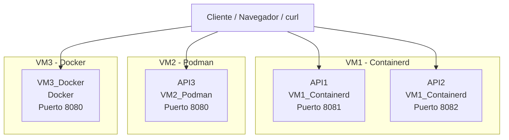
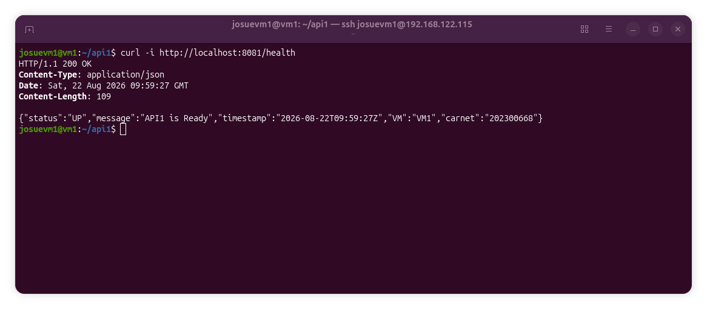
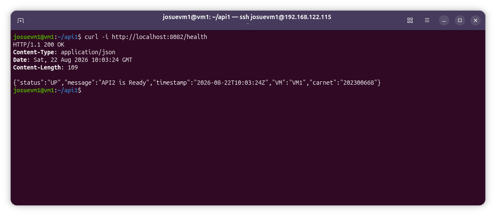
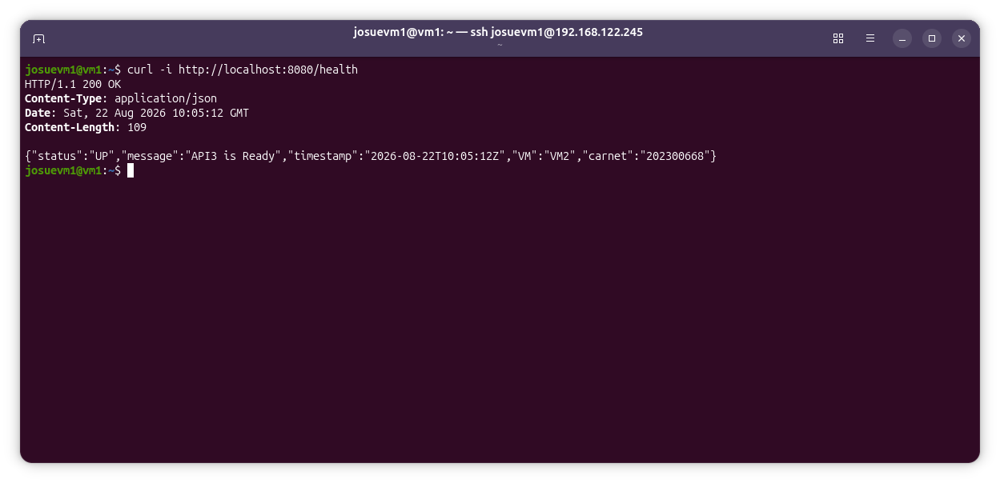
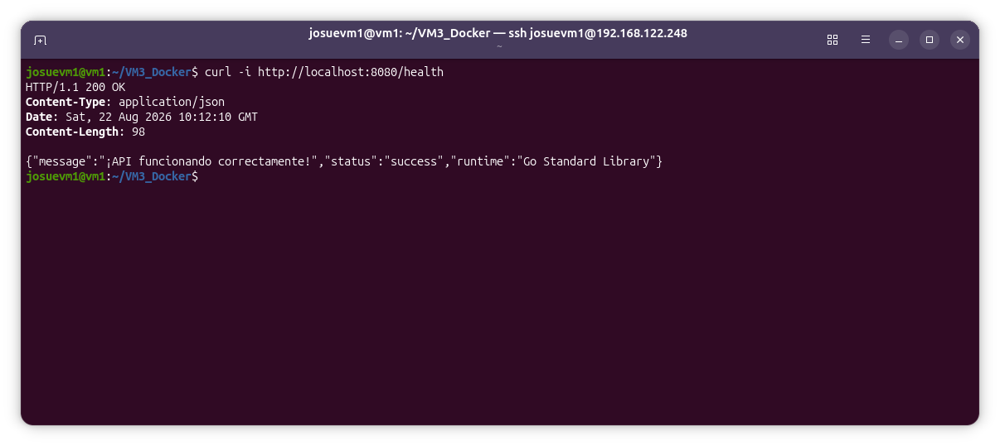

# Manual Técnico

## 1. Objetivo del proyecto

Este proyecto tiene como finalidad implementar y validar un conjunto de servicios en Go desplegados sobre distintos motores de contenedores: Docker, Podman y Containerd. Cada servicio expone un endpoint de salud (`/health`) con información básica de diagnóstico, permitiendo comprobar que la infraestructura se levanta correctamente y responde en los puertos esperados.

El repositorio está organizado de la siguiente manera:

- [VM1_Containerd](./VM1_Containerd)
- [VM2_Podman](./VM2_Podman)
- [VM3_Docker](./VM3_Docker)

## 2. Alcance funcional

La aplicación está compuesta por servicios independientes, cada uno con un comportamiento mínimo pero representativo de un entorno real de despliegue:

- API1: ejecutada en Containerd, puerto `8081`
- API2: ejecutada en Containerd, puerto `8082`
- API3: ejecutada en Podman, puerto `8080`
- VM3_Docker: ejecutada en Docker, puerto `8080`

Todos los servicios incluyen una ruta `/health` que devuelve un JSON con información del estado del servicio, marca de tiempo, VM y carnet del estudiante.

## 3. Arquitectura del sistema



### 3.1 Descripción de la arquitectura

- El proyecto simula tres máquinas virtuales o entornos de ejecución con tecnologías distintas.
- Cada servicio corre de forma aislada y expone un endpoint de salud.
- La comunicación se realiza mediante requests HTTP locales a `localhost` desde el cliente.
- La arquitectura está pensada para evaluar la capacidad de levantar contenedores con distintos runtimes sin cambiar el comportamiento funcional básico de la aplicación.

## 4. Estructura del repositorio

```text
.
├── README.md
├── MANUAL_TECNICO.md
├── GUIA_INSTALACION.md
├── VM1_Containerd/
│   ├── API1/
│   └── API2/
├── VM2_Podman/
│   └── API3/
└── VM3_Docker/
```

## 5. Componentes del sistema

### 5.1 API1

Ubicación: [VM1_Containerd/API1](./VM1_Containerd/API1)

- Puerto: `8081`
- Endpoint principal: `/health`
- Respuesta esperada:

```json
{
  "status": "UP",
  "message": "API1 is Ready",
  "timestamp": "2026-08-21T00:00:00Z",
  "VM": "VM1",
  "carnet": "202300668"
}
```

### 5.2 API2

Ubicación: [VM1_Containerd/API2](./VM1_Containerd/API2)

- Puerto: `8082`
- Endpoint principal: `/health`
- Respuesta esperada:

```json
{
  "status": "UP",
  "message": "API2 is Ready",
  "timestamp": "2026-08-21T00:00:00Z",
  "VM": "VM1",
  "carnet": "202300668"
}
```

### 5.3 API3

Ubicación: [VM2_Podman/API3](./VM2_Podman/API3)

- Puerto: `8080`
- Endpoint principal: `/health`
- Respuesta esperada:

```json
{
  "status": "UP",
  "message": "API3 is Ready",
  "timestamp": "2026-08-21T00:00:00Z",
  "VM": "VM2",
  "carnet": "202300668"
}
```

### 5.4 VM3_Docker

Ubicación: [VM3_Docker](./VM3_Docker)

- Puerto: `8080`
- Endpoint principal: `/health`
- Respuesta esperada:

```json
{
  "message": "¡API funcionando correctamente!",
  "status": "success",
  "runtime": "Go Standard Library"
}
```

## 6. Tecnologías utilizadas

- Lenguaje: Go
- HTTP Server: `net/http` de Go
- Contenedores: Docker, Podman, Containerd
- Formatos de respuesta: JSON
- Orquestación de imagen: Dockerfile para cada entorno

## 7. Comandos principales

### 7.1 Ejecutar localmente con Go

```bash
cd VM1_Containerd/API1
go run .
```

```bash
cd VM1_Containerd/API2
go run .
```

```bash
cd VM2_Podman/API3
go run .
```

```bash
cd VM3_Docker
go run .
```

### 7.2 Ejecutar con Docker

```bash
cd VM3_Docker
docker build -t api-docker .
docker run --rm -d -p 8080:8080 --name api-docker api-docker
```

### 7.3 Ejecutar con Podman

```bash
cd VM2_Podman/API3
podman build -t api-podman .
podman run --rm -d -p 8080:8080 --name api-podman api-podman
```

### 7.4 Ejecutar con Containerd

```bash
cd VM1_Containerd/API1
nerdctl build -t api1:latest .
nerdctl run --rm -d -p 8081:8081 --name api1 api1:latest

cd ../API2
nerdctl build -t api2:latest .
nerdctl run --rm -d -p 8082:8082 --name api2 api2:latest
```

## 8. Verificación con curl

La validación más directa es comprobar la respuesta HTTP del endpoint `/health`.

### 8.1 API1

```bash
curl -i http://localhost:8081/health
```

Salida esperada:

```json
{"status":"UP","message":"API1 is Ready","timestamp":"2026-08-21T00:00:00Z","VM":"VM1","carnet":"202300668"}
```

### 8.2 API2

```bash
curl -i http://localhost:8082/health
```

Salida esperada:

```json
{"status":"UP","message":"API2 is Ready","timestamp":"2026-08-21T00:00:00Z","VM":"VM1","carnet":"202300668"}
```

### 8.3 API3

```bash
curl -i http://localhost:8080/health
```

Salida esperada:

```json
{"status":"UP","message":"API3 is Ready","timestamp":"2026-08-21T00:00:00Z","VM":"VM2","carnet":"202300668"}
```

### 8.4 Docker app

```bash
curl -i http://localhost:8080/health
```

Salida esperada:

```json
{"message":"¡API funcionando correctamente!","status":"success","runtime":"Go Standard Library"}
```

## 9. Capturas de pantalla requeridas


### 9.1 Captura 1: curl exitoso de API1



### 9.2 Captura 2: curl exitoso de API2



### 9.3 Captura 3: curl exitoso de API3



### 9.4 Captura 4: validación de la aplicación Docker


## 10. Observaciones de diseño

- Los servicios están pensados para demostrar independencia de runtime.
- El comportamiento funcional es mínimo, pero suficiente para comprobar disponibilidad y salud del sistema.
- El puerto usado por cada servicio debe ser respetado para evitar conflictos.
- El `JSON` responde con datos de diagnóstico semiestructurados, útiles para pruebas de integración y validación de despliegue.

## 11. Conclusión

El proyecto valida la capacidad de desplegar aplicaciones Go en distintos contextos de contenedores, asegurando que cada entorno responde de forma consistente a un endpoint de salud. La prueba de `/health` se convierte en la verificación final de disponibilidad de cada componente.
